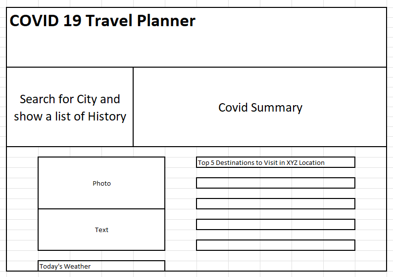
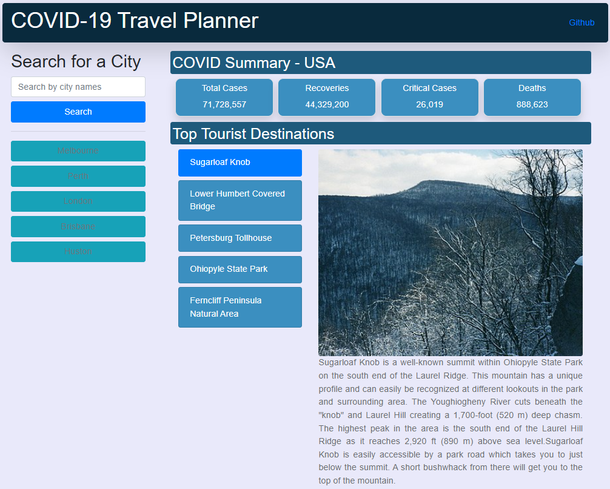

# Covid-19 Travel Planner

## User Story

As a global traveller in the current COVID-19 environment.
I want to be able to search for a international city and be given its current COVID-19 data.
I also want to be given the top 5 tourist destinations for that same city also.

## Description

This searchable web application allows the user to search for a city and simultaneously be given its COVID-19 data and tourist information.
In the planning process of this application a wireframe was created in order to visualise the finalized project.



In order to do this two server side api's were integrated into the application using the fetch function. Bootstrap styling was used to aid in the readability of the data, in turn aiding in the accessability of the user. Local storage was also utilised in order to save and display the users search history which also aids in the usability of the application. The "About Us" link in the navbar links to the projects git repository where the various merges and commits can be viewed.

## Application

The application can be accessed here: https://gabi-m-p.github.io/Group-Project-1/



## Usage

This application can be used in any web browser.

## Credits

Suraj Shrestha
https://github.com/Razor-Ray

Miguel Afable
https://github.com/Mabsky05

Oscar Bryant
https://github.com/oscarcbryant

Gabi Purnell
https://github.com/Gabi-m-p

"Covid 19 Data Api"
https://www.covid19-api.com/
Developer: Gramzivi https://github.com/Gramzivi/covid19-api-sourcerers

"OpenTripMap Api"
https://opentripmap.io/product
Developer: Unknown

<!-- # <Your-Project-Title>
## Description
Provide a short description explaining the what, why, and how of your project. Use the following questions as a guide:
- What was your motivation?
- Why did you build this project? (Note: the answer is not "Because it was a homework assignment.")
- What problem does it solve?
- What did you learn?
## Table of Contents (Optional)
If your README is long, add a table of contents to make it easy for users to find what they need.
- [Installation](#installation)
- [Usage](#usage)
- [Credits](#credits)
- [License](#license)
## Installation
What are the steps required to install your project? Provide a step-by-step description of how to get the development environment running.
## Usage
Provide instructions and examples for use. Include screenshots as needed.
To add a screenshot, create an `assets/images` folder in your repository and upload your screenshot to it. Then, using the relative filepath, add it to your README using the following syntax:
    ```md
    
    ```
## Credits
List your collaborators, if any, with links to their GitHub profiles.
If you used any third-party assets that require attribution, list the creators with links to their primary web presence in this section.
If you followed tutorials, include links to those here as well.
## License
The last section of a high-quality README file is the license. This lets other developers know what they can and cannot do with your project. If you need help choosing a license, refer to [https://choosealicense.com/](https://choosealicense.com/).
---
🏆 The previous sections are the bare minimum, and your project will ultimately determine the content of this document. You might also want to consider adding the following sections.
## Badges

Badges aren't necessary, per se, but they demonstrate street cred. Badges let other developers know that you know what you're doing. Check out the badges hosted by [shields.io](https://shields.io/). You may not understand what they all represent now, but you will in time.
## Features
If your project has a lot of features, list them here.
## How to Contribute
If you created an application or package and would like other developers to contribute it, you can include guidelines for how to do so. The [Contributor Covenant](https://www.contributor-covenant.org/) is an industry standard, but you can always write your own if you'd prefer.
## Tests
Go the extra mile and write tests for your application. Then provide examples on how to run them here. -->